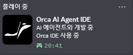

# Orca Presence

[한국어](README.md) | English

A Windows program that shows an `Orca AI Agent IDE` activity on your Discord profile while Orca is running.



The activity is registered automatically when Orca starts and disappears when it exits. If Discord is closed and reopened, the program reconnects on its own. It only polls the process list every 5 seconds, so CPU usage is negligible.

## Requirements

- Windows 10 / 11
- Discord **desktop app** (Rich Presence does not show up on the web version)
- Python 3.9 or later

## Install and run

From PowerShell:

```powershell
py -m pip install -r requirements.txt
py .\orca_presence.py
```

Press `Ctrl + C` to stop.

## Build a single EXE

If you would rather not install Python on the target machine, build an EXE.

```powershell
py -m pip install --upgrade pyinstaller
py -m PyInstaller --noconfirm --clean --onefile --windowed --name "OrcaPresence" .\orca_presence.py
```

The result lands at `.\dist\OrcaPresence.exe`, and that single file is all you need to distribute.

To start it automatically at login, put a **shortcut** to the EXE in the folder that opens via `Win + R` → `shell:startup`.

## Configuration

Edit the constants at the top of `orca_presence.py` and the values in `update_presence()`.

```python
CLIENT_ID = "1526762915376533706"   # Discord Application ID
IMAGE_KEY = "orca"                  # Image key registered in the Developer Portal
ORCA_PROCESS_NAME = "orca.exe"      # Process name to watch for

details="AI 에이전트와 개발 중"      # Text shown on the profile
state="Orca IDE 사용 중"
large_text="Orca AI Agent IDE"
```

If you use the EXE, rebuild it after making changes.

## Troubleshooting

**The activity does not appear** — Check that the Discord desktop app is running and that activity sharing is enabled in User Settings. Then confirm the Orca process is actually named `orca.exe`:

```powershell
Get-Process | Where-Object { $_.ProcessName -match "orca" } | Select-Object ProcessName, Id, Path
```

**The icon does not appear** — The image key registered under Rich Presence > Art Assets in the Discord Developer Portal must match `IMAGE_KEY` in the source exactly. It can take a little while to propagate after uploading.

## Notes

The Discord Application ID is a public identifier, so it is fine to keep it in source. This program does not use any secrets such as a Bot Token or Client Secret.
